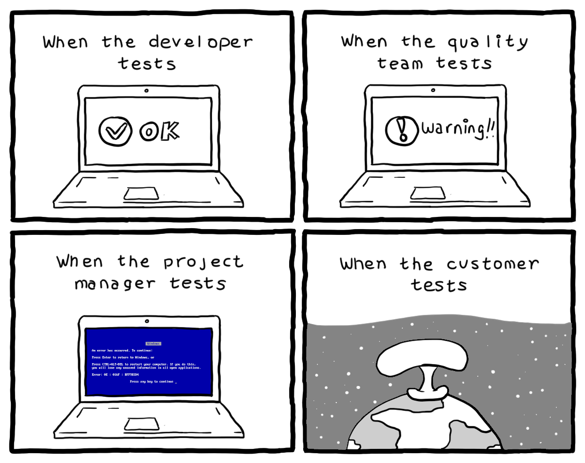

# Exercice d'application de test fonctionnels

Ce projet est utilisé dans le cadre de la formation CDA à l'Afpa.
L'objectif est de travailler sur la mise en place de **tests fonctionnels automatisés** en utilisant Selenium.

## Travail à effectuer

Compléter la classe `SeleniumConfig` pour :
1. initialiser l'URL de l'application à tester
2. modifier le constructeur pour utiliser le driver d'un navigateur installé dans l'environnement de test (dans votre cas, votre machine locale)

Compléter la classe `LoginSeleniumTests` pour les scénarios de test suivants :
1. connexion avec un utilisateur authorisé
2. tentative de connexion avec un utilisateur non authorisé
3. tentative d'accès à une page non existante avec un utilisateur authentifié

Des "TODO" sont disponibles dans le code pour vous aider à mener bien ces tâches.

## Démarrer l'application

Il est possible de démarrer l'application en utilisant Maven :
```ps1
./mvnw spring-boot:run
```

Mais également en utilisant Gradle :
```ps1
./gradlew bootRun
```

**Attention** : veillez à lancer le serveur avant de lancer les tests Sélénium.

Bon courage !


